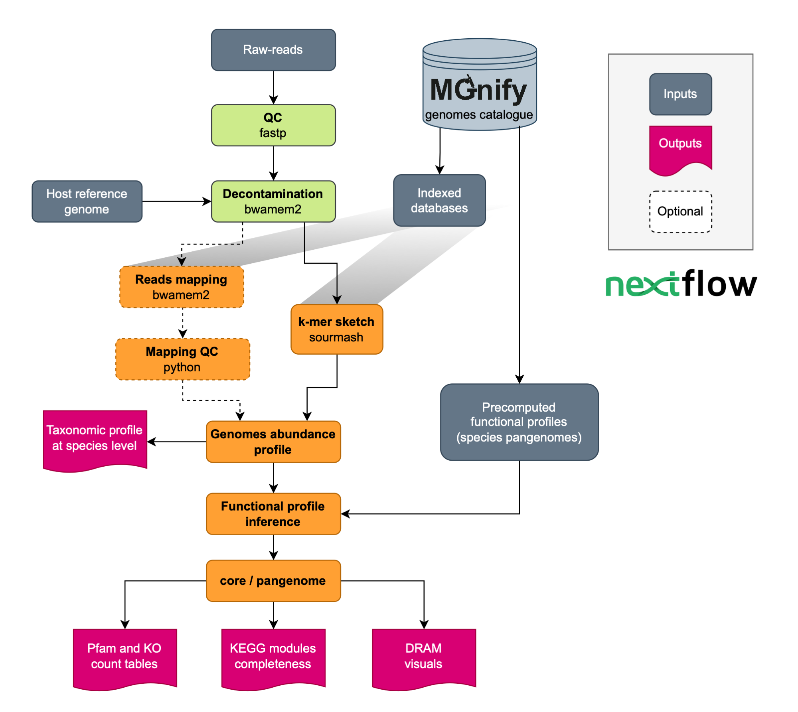

[](https://www.nextflow.io/)
[](https://sylabs.io/docs/)

## Introduction

**ebi-metagenomics/shallowmapping** is a bioinformatics pipeline that generates taxonomic and functional profiles for low-yield (shallow shotgun: < 10 M reads) short raw-reads using [`MGnify biome-specific genome catalogues`](https://www.ebi.ac.uk/metagenomics/browse/genomes) as a reference.

At the moment, the biome selection is limited to the precomputed databases for [chicken-gut-v1-0-1](https://www.ebi.ac.uk/metagenomics/genome-catalogues/chicken-gut-v1-0-1) and [mouse-gut-v1-0](https://www.ebi.ac.uk/metagenomics/genome-catalogues/mouse-gut-v1-0). Other databases can be build for any of the [`MGnify genome catalogues`](https://www.ebi.ac.uk/metagenomics/browse/genomes) upon request by opening an issue in this repository (they will be built on a best-effort basis).

The main sections of the pipeline includes the following steps:

1. Raw-reads quality control ([`fastp`](https://github.com/OpenGene/fastp))
2. HQ reads decontamination versus human, phyX, and host ([`bwa-mem2`](https://github.com/bwa-mem2/bwa-mem2))
3. QC report of decontaminated reads ([`FastQC`](https://www.bioinformatics.babraham.ac.uk/projects/fastqc/))
4. Integrated quality report of reads before and after decontamination ([`MultiQC`](http://multiqc.info/))
5. Mapping HQ clean reads using [`Sourmash`](https://github.com/sourmash-bio/sourmash) and bwa-mem2 (optional)
6. Taxonomic profiles generation
7. Functional profiles inference

The final output includes a species relative abundance table, Pfam and KEGG Orthologs (KO) count tables, a KEGG modules completeness table, and DRAM-style visuals. In addition, the shallow-mapping pipeline will integrate the taxonomic and functional tables of all the samples in the input samplesheet.

<p align="center" width="100%">
   
</p>

## Install and dependencies

This workflow was built using [Nextflow](https://www.nextflow.io/) and follows the [nf-core guidelines](https://nf-co.re/docs/contributing/guidelines). It uses Singularity containers making installation trivial and results highly reproducible. To run the pipeline in your system you need:

- Install [Nextflow version >=21.10](https://www.nextflow.io/docs/latest/getstarted.html#installation)
- Install [Singularity](https://github.com/apptainer/singularity/blob/master/INSTALL.md)

Clone the Shallow-mapping pipeline github repo:

```bash
git clone https://github.com/EBI-Metagenomics/shallowmapping.git
```

### Required reference databases

The first time you run the pipeline you need to put available indexed databases for the decontamination step, MGnify genomes catalogue tables, and some external tables for DRAM visuals generation. MGnify host most of the databases and setting up can be done in a single step by providing the location for decontamination and MGnify databases where the new files will be added. The directories have to already exists. Please provide full paths.

Consider that decontamination reference genomes require ~15-20G of storage.
MGnify catalogue genomes db occupy ~1G.

```bash
cd shallowmapping
bash bin/databases_setup.sh \
    --biome <CATALOGUE_ID> \ # Any of the MGnify catalogue ID for which databases are available
    --catalogue_dbs_path </path/to/catalogue_dbs> \ # Central location of shallow-mapping dbs. A directory with the biome name will be created
    --decont_refs_path </path/to/decont_refs> \ # Central location of reference genomes for decontamination. Other bwamem2 databases can exist there
    --download_bwa <true or false> default = `false`
```

Running the pipeline using bwamem2 is optional. If you want to run the pipeline with this option set the `--download_bwa true`. Consider that this database will occupy >15G of storage in your system.

### Usage

Prepare a samplesheet with your input data that looks as follows:

`samplesheet.csv`:

```csv
sample,fastq_1,fastq_2
paired_sample,/PATH/test_R1.fq.gz,/PATH/test_R2.fq.gz
single_sample,/PATH/test.fq.gz
```

Each row represents a fastq file (single-end) or a pair of fastq files (paired end) where 'sample' is a unique identifier for each dataset, 'fastq_1' is the path to the first FASTQ file, and 'fastq_2' is the path to the second FASTQ file for paired-end data.

Now, you can run the pipeline using the minumum of arguments:

```bash
nextflow run ebi-metagenomics/shallowmapping \
   --biome <CATALOGUE_ID> \
   --input samplesheet.csv \
   --outdir <PROJECT_NAME> default = `results` \
   --shallow_dbs_path <CATALOGUE_DBS_PATH> \
   --decont_reference_paths <DECONT_REFS_PATH/reference_genomes>
```

At the moment, the biome selection is limited to the precomputed databases for [chicken-gut-v1-0-1](https://www.ebi.ac.uk/metagenomics/genome-catalogues/chicken-gut-v1-0-1) and [mouse-gut-v1-0](https://www.ebi.ac.uk/metagenomics/genome-catalogues/mouse-gut-v1-0). Other databases can be built for any of the [`MGnify genome catalogues`](https://www.ebi.ac.uk/metagenomics/browse/genomes) upon request by opening an issue in this repository (they will be built on a best-effort basis).

The central location for the databases can be set in the config file.

Optional arguments include:

```bash
--run_bwa <true or false> default = `false`   # To generate results using bwamem2 besides sourmash
--core_mode <true or false> default = `false` # To use core functions instead of pangenome functions
```

Use `--core_mode true` for large catalogues like the mouse-gut to avoid over-prediction due to an extremely large number of accessory genes in the pangenome.
Nextflow option `-profile` can be use to select a suitable config for your computational resources. You can add profile files to the `config` directory.
Nextflow option `-resume` can be use to re-run the pipeline from the last successfully finished step.

## Test

To test the installed tool with your douwnloaded databases you can run the pipeline using the small test dataset. Even if there are no hits with the biome you are interested, the pipeline should finish successfully. Add `-profile` if you have set up a config profile for your compute resources.

```bash
cd shallowmapping/tests
nextflow run ../main.nf \
    --input test_samplesheet.csv \
    --biome <CATALOGUE_ID> \
    --shallow_dbs_path </path/to/catalogue_dbs> \
    --decont_reference_paths </path/to/decont_refs>
```

## Credits

ebi-metagenomics/shallowmapping pipeline was originally written by @Ales-ibt.

We thank the following people for their extensive assistance in the development of this pipeline:
@mberacochea, @ebi-jlu8

## Citations

> **The nf-core framework for community-curated bioinformatics pipelines.**
>
> Philip Ewels, Alexander Peltzer, Sven Fillinger, Harshil Patel, Johannes Alneberg, Andreas Wilm, Maxime Ulysse Garcia, Paolo Di Tommaso & Sven Nahnsen.
>
> _Nat Biotechnol._ 2020 Feb 13. doi: [10.1038/s41587-020-0439-x](https://dx.doi.org/10.1038/s41587-020-0439-x).
