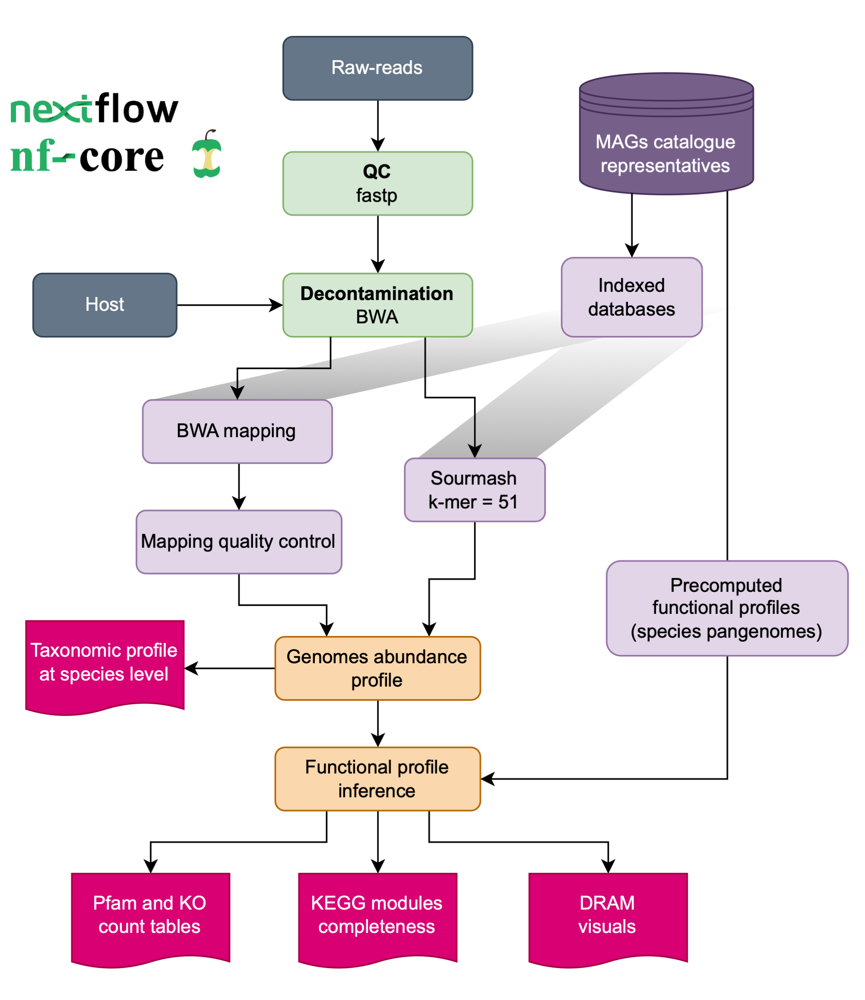

[](https://github.com/ebi-metagenomics/shallowmapping/actions?query=workflow%3A%22nf-core+CI%22)
[](https://github.com/ebi-metagenomics/shallowmapping/actions?query=workflow%3A%22nf-core+linting%22)[](https://doi.org/10.5281/zenodo.XXXXXXX)

[](https://www.nextflow.io/)
[](https://docs.conda.io/en/latest/)
[](https://www.docker.com/)
[](https://sylabs.io/docs/)
[](https://tower.nf/launch?pipeline=https://github.com/ebi-metagenomics/shallowmapping)

## Introduction

**ebi-metagenomics/shallowmapping** is a bioinformatics pipeline that generates functional profiles for shallow shotgun using low-yield (shallow shotgun: < 10 M reads) short- raw-reads mapping versus a database of MGnify biome-specific genome catalogues.

The main sections of the pipeline includes the following steps:
1. Reads quality control ([`FastQC`](https://www.bioinformatics.babraham.ac.uk/projects/fastqc/))
2. Present QC for raw reads ([`MultiQC`](http://multiqc.info/))
3. Reads decontmination ([`bwa-mem2`](https://github.com/bwa-mem2/bwa-mem2))
4. Clean raw-reads mapping using bwa-mem2, [`Sourmash`](https://sourmash.readthedocs.io/en/latest/command-line.html) or both
5. Taxonomic profiles generation
6. Functional profiles inference

The final output includes a species relative abundance table, Pfam and KEGG Orthologs (KO) count tables, a KEGG modules completeness table, and DRAM-style visuals.

<p align="center" width="100%">
   
</p>


## Usage

### Required reference databases

If this is the first time you are running the pipelne with a specific biome, you need to download the precomputed databases from the EBI FTP site running the following command from the 

```bash
cd ebi-metagenomics-shallowmapping
mkdir databases && cd databases
wget ftp/url/biome.tar.gz
tar -xvf biome.tar.gz
```

### Running the pipeline

Prepare a samplesheet with your input data that looks as follows:

`samplesheet.csv`:

```csv
sample_id,fastq_1,fastq_2
test,/PATH/test_R1.fq.gz,/PATH/test_R2.fq.gz
```

Each row represents a fastq file (single-end) or a pair of fastq files (paired end).

Now, you can run the pipeline using:

```bash
nextflow run ebi-metagenomics/shallowmapping \
   -profile <docker/singularity/.../institute> \
   --biome <chicken_gut/mouse_gut/human_skin> \
   --input samplesheet.csv \
   --outdir <OUTDIR>
```

By the moment, the biome selection is limited to the precomputed databases available to downloading. Other databases can be build for any of the [`MGnify genome catalogues`](https://www.ebi.ac.uk/metagenomics/browse/genomes) under request by opening an issue in this repo.


## Credits

ebi-metagenomics/shallowmapping was originally written by @Ales-ibt.

We thank the following people for their extensive assistance in the development of this pipeline:

@mberacochea


## Contributions and Support

If you would like to contribute to this pipeline, please see the [contributing guidelines](.github/CONTRIBUTING.md).

## Citations

<!-- TODO nf-core: Add citation for pipeline after first release. Uncomment lines below and update Zenodo doi and badge at the top of this file. -->
<!-- If you use  ebi-metagenomics/shallowmapping for your analysis, please cite it using the following doi: [10.5281/zenodo.XXXXXX](https://doi.org/10.5281/zenodo.XXXXXX) -->

<!-- TODO nf-core: Add bibliography of tools and data used in your pipeline -->

An extensive list of references for the tools used by the pipeline can be found in the [`CITATIONS.md`](CITATIONS.md) file.

This pipeline uses code and infrastructure developed and maintained by the [nf-core](https://nf-co.re) community, reused here under the [MIT license](https://github.com/nf-core/tools/blob/master/LICENSE).

> **The nf-core framework for community-curated bioinformatics pipelines.**
>
> Philip Ewels, Alexander Peltzer, Sven Fillinger, Harshil Patel, Johannes Alneberg, Andreas Wilm, Maxime Ulysse Garcia, Paolo Di Tommaso & Sven Nahnsen.
>
> _Nat Biotechnol._ 2020 Feb 13. doi: [10.1038/s41587-020-0439-x](https://dx.doi.org/10.1038/s41587-020-0439-x).
