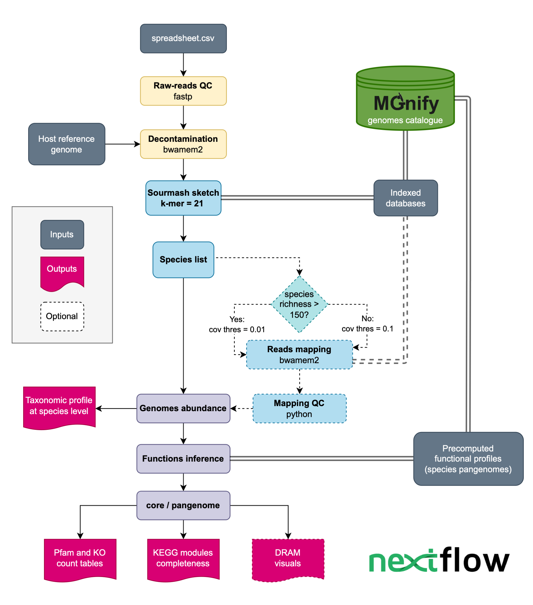

# BioSIFTR

# Biome-specific Shallow-shotgun Inference of Functional Traits through Read-mapping

**ebi-metagenomics/biosiftr** is a bioinformatics pipeline that generates taxonomic and functional profiles for low-yield (shallow shotgun: < 10 M reads) short raw-reads using [`MGnify biome-specific genome catalogues`](https://www.ebi.ac.uk/metagenomics/browse/genomes) as a reference.

The biome selection includes all the biomes available in the [`MGnify genome catalogues`](https://www.ebi.ac.uk/metagenomics/browse/genomes).

The main sections of the pipeline include the following steps:

1. Raw-reads quality control ([`fastp`](https://github.com/OpenGene/fastp))
2. HQ reads decontamination versus human, phyX, and host ([`bwa-mem2`](https://github.com/bwa-mem2/bwa-mem2))
3. QC report of decontaminated reads ([`FastQC`](https://www.bioinformatics.babraham.ac.uk/projects/fastqc/))
4. Integrated quality report of reads before and after decontamination ([`MultiQC`](http://multiqc.info/))
5. Mapping HQ clean reads using [`Sourmash`](https://github.com/sourmash-bio/sourmash) and bwa-mem2 (optional)
6. Taxonomic profile generation
7. Functional profile inference

The final output includes a species relative abundance table, Pfam and KEGG Orthologs (KO) count tables, a KEGG modules completeness table, and DRAM-style visuals (optional). In addition, the shallow-mapping pipeline will integrate the taxonomic and functional tables of all the samples in the input samplesheet.

<p align="center" width="100%">
   
</p>

## Installation

This workflow was built using [Nextflow](https://www.nextflow.io/) and follows [nf-core](https://nf-co.re/) good practices. It is containerised, so users can use either Docker or Apptainer/Singularity to run the pipeline. At the moment, it doesn't support Conda environments.

The pipeline requires [Nextflow](https://www.nextflow.io/docs/latest/getstarted.html#installation) and a container technology such as [Apptainer/Singularity](https://github.com/apptainer/singularity/blob/master/INSTALL.md) or [Docker](https://www.docker.com/).

### Required Reference Databases

The first time you run the pipeline, it will download the required MGnify genomes catalogue reference files and the human_phiX bwa-mem2 index. Other common hosts like mouse will be also automatically downloaded.

Running the pipeline using bwa-mem2 is optional. If you want to run the pipeline with this option set the `--download_bwa true`. This database will occupy considerable storage in your system, depending on the biome (approx database sizes):

- 106 G marine-v2-0
- 38 G human-gut-v2-0-2
- 29 G mouse-gut-v1-0
- 21 G cow-rumen-v1-0-1
- 16 G sheep-rumen-v1-0
- 15 G pig-gut-v1-0
- 15 G tomato-rhizosphere-v1-0
- 10 G chicken-gut-v1-0-1
- 8.5 G maize-rhizosphere-v1-0
- 4.5 G human-oral-v1-0-1
- 2.0 G human-vaginal-v1-0
- 2.2 G non-model-fish-gut-v2-0
- 2.5 G honeybee-gut-v1-0-1
- 1.8 G barley-rhizosphere-v1-0
- 1.5 G zebrafish-fecal-v1-0

In addition, instructions to generate the databases from custom catalogues can be found in the [BioSIFTR paper's repository](https://github.com/EBI-Metagenomics/biosiftr_extended_methods?tab=readme-ov-file#31-processing-custom-genome-catalogues).

### Usage

Prepare a samplesheet with your input data that looks as follows:

`samplesheet.csv`:

```csv
sample,fastq_1,fastq_2
paired_sample,/PATH/test_R1.fq.gz,/PATH/test_R2.fq.gz
single_sample,/PATH/test.fq.gz
```

Each row represents a fastq file (single-end) or a pair of fastq files (paired end) where 'sample' is a unique identifier for each dataset, 'fastq_1' is the path to the first FASTQ file, and 'fastq_2' is the path to the second FASTQ file for paired-end data.

Now, you can run the pipeline using the minimum arguments:

```bash
nextflow run ebi-metagenomics/biosiftr \
   --biome <CATALOGUE_ID> \
   --input samplesheet.csv \
   --outdir <PROJECT_NAME> default = `results` \
   --dbs </path/to/dbs> \
   --decontamination_indexes </path to folder with bwa-mem2 indexes>
```

The central location for the databases can be set in the config file.

Optional arguments include:

```bash
--run_bwa <boolean> default = `false`   # To generate results using bwa-mem2 besides sourmash
--core_mode <boolean> default = `false` # To use core functions instead of pangenome functions
--run_dram <boolean> default = `false`  # To generate DRAM results
```

Use `--core_mode true` for large catalogues like the human-gut to avoid over-prediction due to a large number of accessory genes in the pangenome.
Nextflow option `-profile` can be used to select a suitable config for your computational resources. You can add profile files to the `config` directory.
Nextflow option `-resume` can be used to re-run the pipeline from the last successfully finished step.

#### Available biomes

This can be any of the MGnify catalogues for which shallow-mapping databases are currently available

| Biome              | Catalogue Version                                                                    |
| ------------------ | ------------------------------------------------------------------------------------ |
| barley-rhizosphere | [v1.0](https://www.ebi.ac.uk/metagenomics/genome-catalogues/barley-rhizosphere-v1-0) |
| chicken-gut        | [v1.0.1](https://www.ebi.ac.uk/metagenomics/genome-catalogues/chicken-gut-v1-0-1)    |
| cow-rumen          | [v1.0.1](https://www.ebi.ac.uk/metagenomics/genome-catalogues/cow-rumen-v1-0-1)      |
| human-gut          | [v2.0.2 ⚠️](https://www.ebi.ac.uk/metagenomics/genome-catalogues/human-gut-v2-0-2)   |
| human-oral         | [v1.0.1](https://www.ebi.ac.uk/metagenomics/genome-catalogues/human-oral-v1-0-1)     |
| human-vaginal      | [v1.0](https://www.ebi.ac.uk/metagenomics/genome-catalogues/human-vaginal-v1-0)      |
| honeybee-gut       | [v1.0.1](https://www.ebi.ac.uk/metagenomics/genome-catalogues/honeybee-gut-v1-0-1)   |
| marine             | [v2.0](https://www.ebi.ac.uk/metagenomics/genome-catalogues/marine-v2-0)             |
| maize-rhizosphere  | [v1.0](https://www.ebi.ac.uk/metagenomics/genome-catalogues/maize-rhizosphere-v1-0)  |
| mouse-gut          | [v1.0](https://www.ebi.ac.uk/metagenomics/genome-catalogues/mouse-gut-v1-0)          |
| non-model-fish-gut | [v2.0](https://www.ebi.ac.uk/metagenomics/genome-catalogues/non-model-fish-gut-v2-0) |
| pig-gut            | [v1.0](https://www.ebi.ac.uk/metagenomics/genome-catalogues/pig-gut-v1-0)            |
| sheep-rumen        | [v1.0](https://www.ebi.ac.uk/metagenomics/genome-catalogues/sheep-rumen-v1-0)        |
| tomato-rhizosphere | [v1.0](https://www.ebi.ac.uk/metagenomics/genome-catalogues/tomato-rhizosphere-v1-0) |
| zebrafish-fecal    | [v1.0](https://www.ebi.ac.uk/metagenomics/genome-catalogues/zebrafish-fecal-v1-0)    |

> **⚠️ Note for human-gut**:
>
> The human-gut shallow-mapping database was created manually by re-running Panaroo to reconstruct the pangenomes. This is likely to have caused discrepancies in the pangenomes, so please bear that in mind.

## Test

To test the installed tool with your downloaded databases, you can run the pipeline using the small test dataset. Even if there are no hits with the biome you are interested in, the pipeline should finish successfully. Add `-profile` if you have set up a config profile for your compute resources.

```bash
cd biosiftr/tests
nextflow run ../main.nf \
    --input test_samplesheet.csv \
    --biome <CATALOGUE_ID> \
    --dbs </path/to/dbs> \
    --decontamination_indexes </path to folder with bwa-mem2 indexes>
```

## Credits

ebi-metagenomics/biosiftr pipeline was originally written by @Ales-ibt.

We thank the following people for their extensive assistance in the development of this pipeline:
@mberacochea
